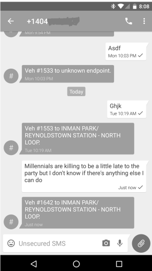

Glue for the Marta App: Which Bus Is Gonna Short-Turn?
------------------------------------------------------

MARTA's On The Go app is useless for some bus routes, like the #6 bus. Based on feedback from a #6 rider, this app aims to fill the gap, to distill unwieldy public data into actionable facts the riders need for the app to be useful, accessible via text.

Marta's #6 bus route starts at Lindbergh Station, passes by Emory University, then goes to Inman Park Station... most of the time. However, some southbound rush hour trips from Lindbergh stop and turn around at Emory. This is called a [short-turn](https://en.wikipedia.org/wiki/Short_turn). If you were wanting to go to Inman Park, you'd have to wait for the next bus. 

Unfortunately, the MARTA On The Go app doesn't have any way to show you an en-route bus's destination; there's no way in the app to know if a bus is running the full route or short-turning. Not knowing whether the next bus will take you home can be a problem for #6 bus riders; they can end up waiting at the stop for a long time. At rush hour, this problem renders the On The Go app basically useless.

This application is meant to be a stopgap solution. Bus riders can text a special number to receive two pieces of information about each southbound en-route #6 buses: the scheduled end point of the bus route and the vehicle number. That vehicle number can be cross-correlated with the data from the MARTA On The Go app for bus realtime(-ish) locations and also with the number on a physical bus, once it arrives.

Installation
============

This repo has two implementations of the same code, one in Ruby (in `ruby/`) and one in Node.js (in `node`). The Ruby one came first; the Node one is for use in Google Compute Engine, where this is currently running.

Common steps
-------------

If you were to want to set up the Ruby version= yourself, you'll have to do these setup steps:

1. download MARTA's [current GTFS dataset](http://www.itsmarta.com/google_transit_feed/google_transit.zip) ([info page](http://www.itsmarta.com/app-developer-resources.aspx))
2. install [GTFSDB](https://github.com/OpenTransitTools/gtfsdb) and its dependencies (`pip install sqlalchemy geoalchemy`)
3. Then load the GTFS data into a Postgresql database called `marta` with this command: `gtfsdb-load --database_url postgres:///marta  google_transit.zip` (You'll have to create the database first, with `createdb marta`)

Ruby steps
-----------

4. Get Twilio creds (a SID, an Auth Token) and a phone number, and put them in a file called `secrets.yaml`, basing it off of the example in `secrets.yaml.example`. You'll probably want to test this setup.
5. run `ruby/listen.rb`.
5. Now the "server" is listening -- but only on your local network. In order to be able to receive text messages, you'll have to either deploy this project on cloud infrastructure like AWS or Heroku or, for testing, use a tool like ngrok to make the version of it running locally visible to the world on the internet (which is as scary as it sounds). Whatever method you use, you'll eventually get a URL on which the server is listening. Be sure to paste that in the Twilio settings for your Twilio phone number SMS callback URL. You can test receiving a text with a command like this `curl -XPOST example.com/martabus --data "From=%2B14045551234"` (where `example.com/martabus` is replaced with your server's URL.)

Node steps
-----------
4. run `bash make_map_of_trip_ids_to_dests.sh > dests.json`, which creates a JSON file called `dests.json` containing a mapping of trip IDs of the 6 bus to their endpoint.
5. move that CSV to the `node/` folder with `mv dests.json node/`
6. run index.js's `doTheThing` whenever you get a web request using Google Compute engine (or AWS Lambda or whatever). To deploy, you may want to zip the node dir with `zip ../martagoogle.zip -r .` in the `node/` dir.

Common steps again
-------------------
7. To use the service "in production" text anything to your Twilio number. You should receive a text back like "Veh. 1553 to INMAN PARK/REYNOLDSTOWN STATION". You can use that vehicle number (1553, in this case) to match up the end point of the bus to the bus with that same vehicle number in the Marta On The Go app.

At any given time, you can "simulate" the response a rider texting the service would get by running `ruby make_message.rb`. Or, to send a text with the results, run `ruby ruby/make_message.rb | ruby ruby/send_sms.rb +14045551234`, substituting your destination number for the one in the example.

This could probably be easily extended to cover other MARTA bus routes that short-turn at rush hour. `API_URL` in `make_message.rb` could be changed to the API URL for another bus service; there's no other hard-coded reference to the 6 bus. (But I have no idea if this is even a problem for riders of other MARTA bus lines.)

Do you want to use this service?
================================

Email me, I'll send you the number to text. Seriously, I'd be happy to, I just don't want to publish it here.